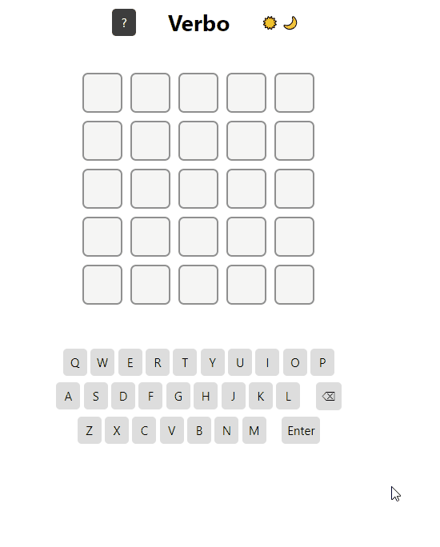
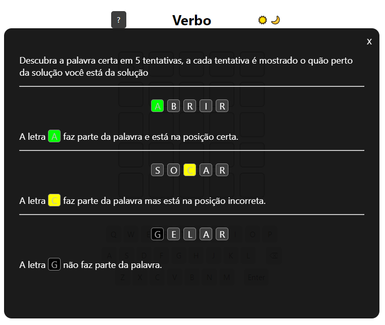

# Verbo
 

# Sobre o projeto

[verbo.netlify.app](verbo.netlify.app)

    Verbo é um projeto que me desafiei a fazer após jogar o jogo <a href="https://term.ooo">Termo.</a>

    O projeto consiste em adivinhar um verbo com 5 letras e em 5 tentativas. A cada tenteativa é mostrado o quão perto da solução você está.

## Exemplo

 

 

# Tecnologias utilizadas

- HTML
- CSS
- JS

Nodejs foi utilizado apenas para capturar as palavras na internet. Para isso utilizei a biblioteca <a href="https://pptr.dev">puppetter.</a> No entanto, todo lógica do projeto foi feita com JS puro.

## Implementação
- Produção implementada no Netlify

# Autor

Diego Cruz's

<a href="https://www.linkedin.com/in/diego-cruz-56436b248/">https://www.linkedin.com/in/diego-cruz-56436b248/</a>